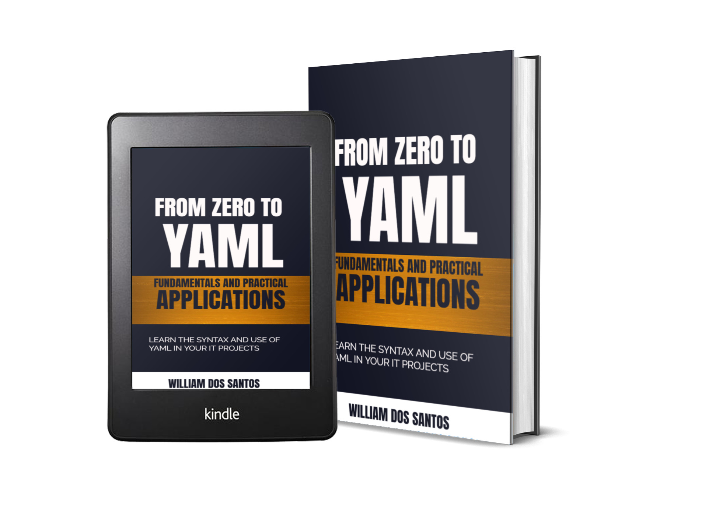

# Web-Based Quiz Project - From Zero to YAML

Welcome to the repository for the **Final Project (Chapter 8)** from the book **"From Zero to YAML: Fundamentals and Practical Applications"** by **William dos Santos**.

## About the Book

**"Unlock the Power of YAML: Master the Basics and Practical Applications with 'From Zero to YAML'!"**

This book takes you from a beginner to an expert in YAML, offering hands-on examples, real-world applications, and detailed explanations of YAML syntax and structure. Perfect for IT professionals and anyone looking to leverage YAML for configuration and data storage.

**Now available on [Amazon](https://www.amazon.com) and at major bookstores!**

  <!-- Ensure the image is placed in the repository -->

---

## Project Overview:

This web-based quiz allows users to upload a `quiz.yaml` file to load quiz questions, answer them, and get a score based on their responses. It’s a practical example of how YAML can be integrated into web applications for configuration and data management.

### Files in this repository:
- **index.html**: A webpage that displays the quiz. It loads the quiz data from a YAML file.
- **quiz.yaml**: A sample YAML file containing quiz data, including questions, options, correct answers, and the passing score.
- **yamlbook.jpg**: The cover image of the book *From Zero to YAML: Fundamentals and Practical Applications*.

---

## How to Use:

1. **Clone this repository**:
   ```bash
   git clone https://github.com/your-username/quiz-project-from-zero-to-yaml.git
